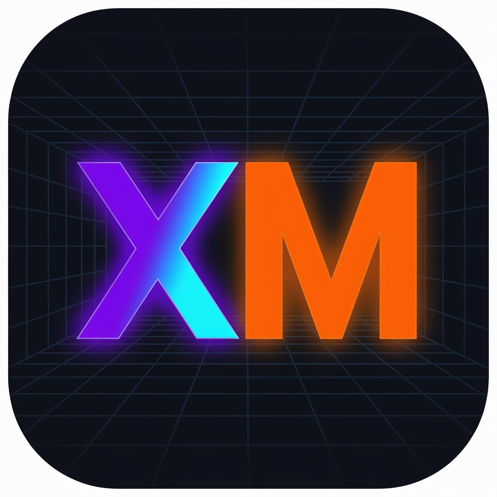
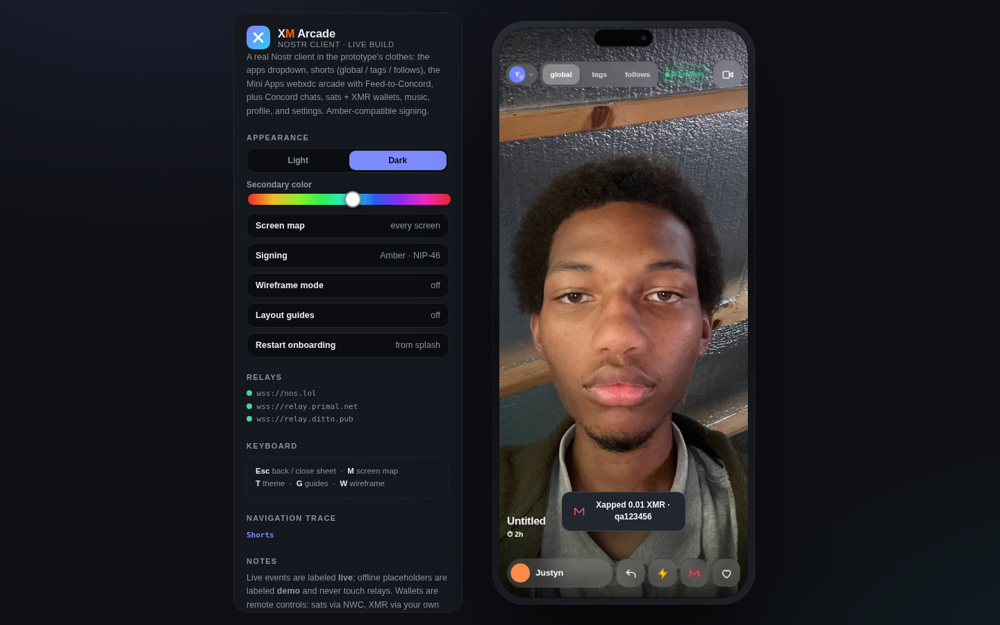

# XM Arcade — a live Nostr client

Games, shorts, music and encrypted chats — owned by nobody, signed by you.

XM Arcade is a **real, working Nostr client** wearing the UI from the hand-drawn
prototype (same dropdown nav, shorts feed, Mini Apps grid, Concord chats, wallet,
music, settings, light/dark themes, workbench + screen map). The prototype's CSS
design system is reused verbatim (`css/app.css`); everything underneath is live.



No build step to run it. No CDN at runtime. Just static files + relays.

## Get the app

- **Android:** download `XM-Arcade-v1.0.0.apk` from
  [Releases](../../releases) and install it (allow "unknown apps" once).
  Requires Android 7+ (`com.xmarcade.app`).
- **Web:** download `XM-Arcade-standalone.html` from
  [Releases](../../releases) — the whole client in one file. Double-click it,
  or serve this folder: `python3 -m http.server 8091` → http://localhost:8091/

On a phone-width viewport the workbench hides and the app goes full-bleed.
On desktop you get the workbench: theme, screen map (`M`), wireframe (`W`),
guides (`G`), relay health, nav trace. `Esc` goes back.

## What's inside

| Pane | What it really does |
|---|---|
| **Profile** | Kind-0 metadata, kind-1/6 notes feed, follow/unfollow (kind-3), post composer with Blossom attachments, emoji reactions/repost/reply, sats zap + XMR xap |
| **Shorts** | NIP-71 kinds 21/22 global · tags · follows feeds, tap-to-play/pause video, inline replies, tag follow, zap + xap, Studio upload (Blossom + kind-22) |
| **Mini Apps** | webxdc arcade: 2 built-in playable games, `.xdc`/`.webxdc`/`.zip` uploads (extracted + executed in a `sandbox="allow-scripts"` iframe with a webxdc.js shim), Nostr + Blossom `#webxdc` discovery (incl. NIP-50 search), **Feed to Concord channel** (Blossom upload + channel Play card) |
| **Music** | Relay audio discovery (notes + kind-1063 carrying audio), search, hashtag filters, queue, sticky player, per-track zaps + XMR xaps, Studio audio publish |
| **Chats** | **Concord groups**: live NIP-29 groups (kinds 39000 + kind-9, live tail subscription). Public channels are signed plaintext; 🔒 channels add a shared **Concord key** (NIP-44) created on-device, importable/exportable, shareable to members as NIP-59 gift wraps |
| **Wallet** | **sats**: real NWC (NIP-47) — balance, invoices, payments, Lightning-address send, NIP-57 zaps, self-custodial Alby Hub guide. **XMR**: real `monero-wallet-rpc` adapter — version/address/balance/transfer, one-tap Xaps (wallet RPC or external-app handoff like Cake Wallet). Neither half ever asks for or stores seeds |
| **Settings** | Key backup (npub/nsec), theme, starting pane, relay editor with live health, group-relay editor, Blossom servers, followed tags |

**Signing (Amber-compatible):** device nsec or **NIP-46 remote signer** — paste a `bunker://` URI exported
from Amber, or tap **Pair a new signer** and **Open in Amber** — XM Arcade hands the pairing
to your signer app and logs you in on approval. Keys never leave the signer.

**Offline honesty:** live content carries a `live` badge; when relays are
unreachable the app falls back to clearly-labeled `demo` placeholders that never
touch the network.

## Build from source

```sh
git clone <your-fork> xm-arcade && cd xm-arcade
```

**Single-file web app** (needs `python3`; esbuild is vendored for Linux x64,
otherwise `esbuild`/`npx` on PATH is used):

```sh
python3 tools/build-web.py          # -> release/XM-Arcade-standalone.html
```

**Browser QA** (needs `node` + Playwright Chromium — boots the app, creates an
account against live relays, mounts an embedded game, asserts zero errors):

```sh
npm i playwright && npx playwright install chromium
node tools/qa/standalone.js --shot docs/screenshot.png
```

**Android APK** (needs JDK 17+, Android SDK with platform-34 + build-tools 34,
Gradle 8.7+; `ANDROID_HOME`/`GRADLE_HOME` honored):

```sh
./tools/build-apk.sh debug            # -> release/XM-Arcade-debug.apk
```

**Signed release APK** — keys via environment (never commit them):

```sh
export ORG_GRADLE_PROJECT_XM_STORE_FILE=/path/to/xm-arcade-release.keystore
export ORG_GRADLE_PROJECT_XM_STORE_PASSWORD='...'
export ORG_GRADLE_PROJECT_XM_KEY_ALIAS=xmarcade
export ORG_GRADLE_PROJECT_XM_KEY_PASSWORD='...'
./tools/build-apk.sh release          # -> release/XM-Arcade-vX.Y.Z.apk
```

Back up your keystore + passwords (password manager *and* offline copy). If you
lose them you can never publish an update — Android requires the same key.

**CI / cutting a release:** pushes build the web file + debug APK automatically
(see [`.github/workflows/build.yml`](.github/workflows/build.yml)). To ship:

1. Bump `VERSION`, add a `CHANGELOG.md` entry.
2. Set repo secrets `XM_KEYSTORE_BASE64` (base64 of the keystore),
   `XM_STORE_PASSWORD`, `XM_KEY_ALIAS`, `XM_KEY_PASSWORD`.
3. `git tag v1.0.0 && git push origin v1.0.0` — CI builds, signs, and publishes
   the GitHub Release with the APK + standalone HTML.

No terminal? Publish entirely in the browser: upload the project files with
*Add file → Upload files* (skip the `release/` folder — its two files get
attached to the Release instead), then *Releases → Draft a new release*,
attach `XM-Arcade-vX.Y.Z.apk` + `XM-Arcade-standalone.html`, and publish.
The automated signing step quietly skips itself when no signing secrets exist.

## Project layout

```
index.html            workbench + phone shell, module entry
VERSION               single source of truth for the marketing version
CHANGELOG.md          release notes (also used as the GitHub Release body)
css/app.css           prototype design system (reused verbatim)
css/live.css          live-client additions (badges, players, frames, sheets)
js/vendor/            vendored nostr-tools (pure crypto) + SimplePool — MIT,
                      © Paul Miller (paulmillr.com). No network needed for crypto.
js/util.js            dom/store/icons/avatar/format helpers
js/nostr.js           relay pool, NIP-19, publish/query, Blossom upload
js/signer.js          local / NIP-46-Amber signing + NIP-44
js/data.js            profiles, notes, NIP-71 shorts, NIP-29+Concord groups,
                      music, #webxdc discovery, emoji packs, demo fallback
js/wallets.js         NWC client, LNURL + BOLT11 helpers, NIP-57 zaps,
                      monero-wallet-rpc adapter
js/webxdc.js          zip reader, catalog, sandboxed runner + shim, channel feed
js/ui.js, js/ui2.js   screens + bottom sheets (same class vocabulary as mockups)
js/app.js             router, actions, live loading, workbench, boot
webxdc/               webxdc.js shim + 2 built-in games (hello, taprace)
tools/build-web.py    single-file builder (esbuild IIFE + inline CSS + games)
tools/build-apk.sh    debug/release APK builder (rebuilds web, signs, verifies)
tools/qa/standalone.js  headless release QA (Playwright)
tools/esbuild-linux-x64 vendored bundler so web builds work anywhere on x64
android/              native shell: com.xmarcade.app, min SDK 24, target 34
docs/screenshot.png   QA-captured workbench shot used above
release/              generated outputs (git-ignored): standalone HTML + APKs
```

## Wallets, honestly

- **Sats (hot):** connect any NWC wallet (Alby Hub, Mutiny+, …) with a small
  budget. XM Arcade only relays NWC requests; funds live in your wallet.
- **XMR (hot):** point the app at your own `monero-wallet-rpc`, e.g.
  `monero-wallet-rpc --rpc-bind-port 18082 --disable-rpc-login` on a trusted
  machine (restricted RPC + TLS recommended). The app never sees your 25 words.
- Both halves are **remote controls with disconnect buttons**, for play money
  and zaps — not life savings. See the in-app Hot wallet notice.

## NIPs spoken

01 · 04 (retired, not used) · 09 (NIP-44 chat encryption) · 10 · 19 · 29 ·
44 · 46 · 47 · 57 · 59 · 71 · 96/Blossom (BUD-01/02 uploads + kind-24242 auth).

## Verified (v1.0.0)

`tools/qa/standalone.js` boots the single-file build headless: onboarding
renders, a fresh account is created against **live relays (3/3)** with a real
NIP-71 short playing, both embedded games mount error-free — **zero page
errors**. Earlier live-network checks exercised all 7 panes, real NIP-29 groups
with kind-9 messages, real audio tracks, and a signed kind-1 publish read back
from 3/3 relays.

## License

MIT — see [LICENSE](LICENSE). Vendored `js/vendor/nostr-tools` stays
MIT © Paul Miller.
