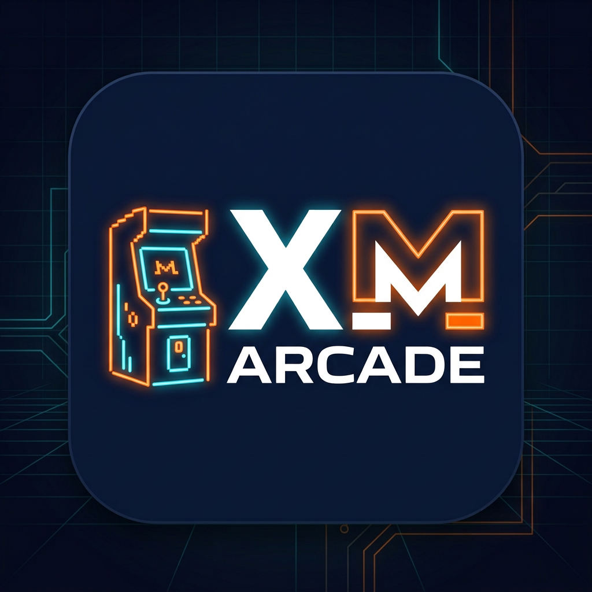

# XM Arcade — Native Android (Kotlin + Jetpack Compose)

**Welcome to XM Arcade** — a smooth, intuitive Nostr client that introduces people to Nostr through *fun* — not micro-blogging. Shorts, Mini Apps, Music, Concord chats, Wallets (sats⚡ + XMR M).

> Complete rebuild from scratch. Previous agent failed → this repo is fresh, native Kotlin with Jetpack Compose, built directly from your hand-drawn UI references and design intents.



### Logo
Monero orange + white “M” for the M in **XM Arcade** (see `app/src/main/res/drawable/app_logo.png` + mipmaps). Used for launcher icon and welcome screen.

---

## What’s implemented

### References honored
| Feature | Reference |
|---|---|
| External XMR wallet / payment targets | **Amethyst** (`paymentTargets`) – “use external wallet” + paste field |
| Sats NWC | **Amethyst / Ditto** NWC flow |
| Native wallets | **Cake Wallet** construction for sats & XMR (auto-create for new accounts) |
| Concord groups + webxdc + call | **Armada** + [Concord protocol](https://github.com/concord-protocol/concord) – NOT NIP-29 |
| Mini Apps / webxdc | **Armada + Ditto** |
| Music upload/playback | **Nostria** handling, but custom UI; music keeps playing across panes except Shorts, persistent “Now Playing” banner |
| Shorts feed | **Amethyst + Ditto**, TikTok rival – hashtags clickable to follow, inline reactions/zaps/xaps, blossom redundancy via **nostu.be** |
| Online now chip | **Wisp** presence protocol |

### Screens (all vertically scrolling)
- **Login** – Create Account (generates npub/nsec, random default avatar from 8 bundled), Sign with nsec (paste), Login with Amber (`com.greenart7c3.nostrsigner` intent / NIP-55)
- **Shorts** – Header `your pfp | Global | Tags | Following | online now | upload`. Video cards with `#tag #tag …` on overlay (click → “follow tag? Y/N”), row: avatar → profile popup (follow/visit) • react 😊 • zap ⚡ • xap M • share → concord • details. Upload dialog: file + description + space-separated hashtags → uploads to *all* blossom servers simultaneously.
- **Mini Apps** – Header with category tags (`fps` etc.) + upload. Cards: logo + App Name + Play + hashtags + footer: uploader avatar (collapse/open description) • react • zap • xap • forward share (sends to concord chat group) • expand ✓ + scroll bar. Detail expansion shows full description.
- **Music** – Header with view/add-to-queue toggle + online now + upload + add-to-queue. Rows: album art + artist + album + track + play bar + zap/xap + queue add. Upload: audio file + tags. ExoPlayer persists across navigation; bottom “Now Playing” bar on every pane except Shorts.
- **Chats** – Concord groups. Header: Chats + Unread filter + Discover + block/list toggle + + create. Rows: grab handle (reorder) • avatar • Chat name @ + #channel #channel • unread badge (number = recent unread) • @ mention badge (only if mentioned). Tap channel → specific channel, tap row → chat. Mirrors Armada.
- **Wallet** – Header: Wallet + pay ↑ + receive ↓ + add/create. Cards: Monero M 0.02 $X.XX and ⚡ 27,000 $X.XX → tap for recent transactions log. Bottom card explains NWC vs native (Cake) choices. Dialogs for linking NWC and external XMR.
- **Profile** – Banner + avatar (tap to edit / zap-xap chips), biography, “Post a new note”, list of notes with reply/repost; other users’ profiles show zap/xap chips via your wallet. New profiles pick random avatar from 8 defaults; edit allows upload or re-pick.
- **Settings** – Zap/XAP presets • light/dark + hue slider for secondary color • hashtag follows add/remove • relays & blossom servers (all removable) • backup nsec • logout / login second account (drawer shows “switch profiles” when >1) • delete account • delete one/both wallets.
- **Navigation** – Bottom bar Shorts/Mini Apps/Music/Chats/Wallet + drawer dropdown (Profile … Settings) with “online now” wisp detail (“click to see people you follow who are online right now”).

### Defaults (for newly created accounts only; otherwise use profile’s existing relays)
```kotlin
relays = [nos.lol, ditto.pub, relay.primal.net, relay.fountain.fm]
blossom = [blossom.ditto.pub, blossom.primal.net, blossom.data.haus]
followTags = [#music, #action, #family, #funny, #nature, #rock, #country, #alternative, #platformer, #fps]
```
All removable in Settings — nothing is hard-forced.

---

## Tech stack
- **Kotlin 1.9.22**, **Compose BOM 2024.10**, **Material3**, **Navigation Compose 2.8.4**
- **Hilt** DI, **DataStore** for pubkey/nsec (encrypted) + settings, **Room** ready
- **OkHttp + WebSocket** relay manager (NIP-01/42 scaffolding), **BlossomManager** with `uploadToAll()` coroutine redundancy
- **Media3 ExoPlayer 1.4.1** for Shorts + Music (foreground service)
- **Coil 2.7** for blossom/media images
- **secp256k1-kmp 0.14** + SpongyCastle for key generation, bech32 placeholder (swap to `bitcoinj` bech32 for prod)

---

## Project structure
```
XM-Arcade/
├─ app/src/main/java/com/xmarcade/
│  ├─ XMArcadeApp.kt, MainActivity.kt
│  ├─ data/{models, nostr/RelayManager, blossom/BlossomManager, wallet/WalletManager, concord/ConcordManager, local/PreferencesManager}
│  ├─ ui/{theme, navigation, components/{CommonComponents, AppScaffold}, screens/{login, shorts, miniapps, music, chats, wallet, profile, settings}}
│  ├─ utils/{Defaults, NostrCrypto}
│  └─ di/AppModule.kt
├─ app/src/main/res/{drawable/app_logo.png + 8 profile pics, mipmap/ic_launcher.png, values, xml}
└─ docs/
```

### 8 default profile pictures
Bundled under `app/src/main/res/drawable/` (Profile Picture 1..8). Randomly assigned on new account creation — re-selectable in Edit Profile.

---

## Building

**Requirements:** Android Studio Hedgehog+, JDK 17, Android SDK 34.

```bash
git clone https://github.com/Josephus-MORP/XM-Arcade
cd XM-Arcade
# open in Android Studio or:
./gradlew assembleDebug
# APK at app/build/outputs/apk/debug/app-debug.apk
```

No extra setup needed — DataStore defaults apply on first launch. To test without relays, the ViewModels ship with sample data.

### Signing & Amber testing
- Install **Amber** (`com.greenart7c3.nostrsigner`) on device for “Login with Amber” intent.
- For NWC, use a test Alby/Ditto NWC string in Wallet → Link NWC.
- For XMR external wallet, paste any `44A...` address; app stores as `xmrWalletInfo` and skips native Cake creation.

---

## Key behaviors vs. sketch nuances
- Every pane lazy list => vertical scroll “to keep showing more options.”
- **Online now** (Wisp): header chip + count, plus detail list placeholder (`TODO: wisp relay subscription`).
- **Hashtags over video** are literally clickable `Text` with `clickable { followTag }`.
- **Music Now Playing** stays pinned via `MainActivity` hosting a shared `MusicViewModel`; hidden only on Shorts route.
- **Vault safety:** `backup_rules.xml` + `data_extraction_rules.xml` exclude `secret_nsec.xml` from cloud backup.
- **Blossom redundancy:** `BlossomManager.uploadToAll()` = `async` fan-out to all servers, returns per-server `UploadResult`.

---

## Next steps (production hardening)
- [ ] Replace placeholder bech32 (`toNpub/toNsec`) with real BIP-173 via `fr.acinq.bitcoin:bitcoin-kmp` or `bitcoinj`.
- [ ] Wire `RelayManager` to rust-nostr or `kotlin-nostr` for NIP-01/42/57, NIP-65 relay list, and kind 0/1/30023 handling.
- [ ] Implement NIP-98 blossom auth in `BlossomManager` (signed Authorization header).
- [ ] Integrate Cake Wallet SDK: `cake_wallet` → flutter bridge → native LDK + monero-j.
- [ ] Concord: clone `concord-protocol` repo, implement X3DH + webxdc `ApplicationRunner`.
- [ ] Webxdc viewer: add Armada’s `webxdc.js` bridge + file picker for `.xdc`.
- [ ] Music: adapt Nostria’s `MusicUploadViewModel` (Blossom URL in `imeta` tag + `kind 30440`).
- [ ] Wisp: subscribe to `kind 30078` presence events on `wisp` relay, map to online count.
- [ ] Add instrumented tests for wallet flows + UI tests for Shorts vertical pager.

---

## License
MIT (until upstream Nostr/Cake dependencies dictate otherwise). Monero orange “M” is community CC.

Built for **Vienna** — 2026-09-18 — by XM Arcade rebuild agent.
